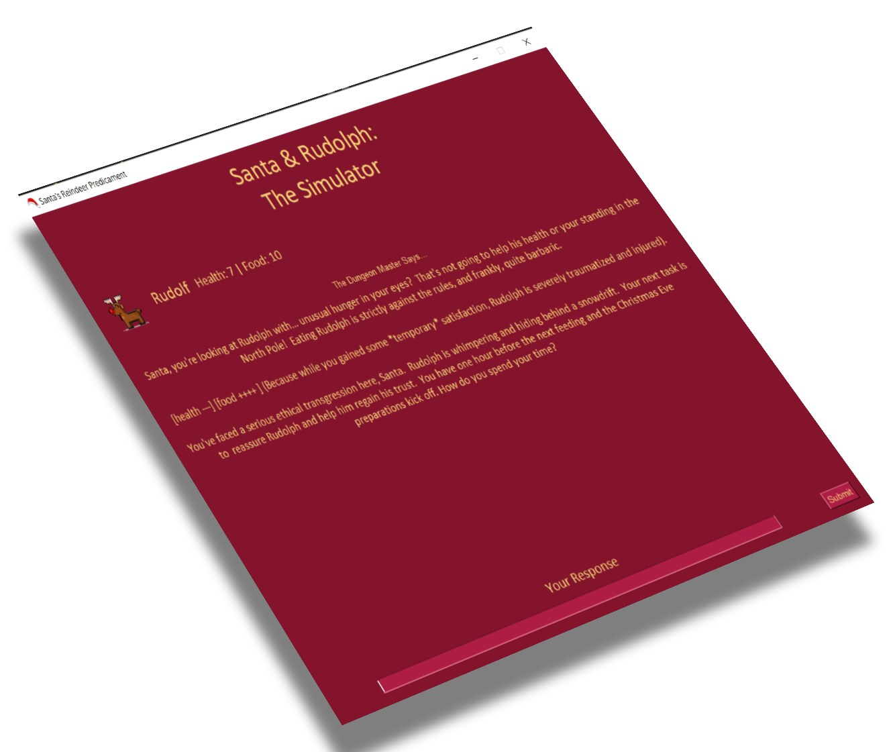

# Santa & Rudolph: The Simulator



A text-based simulation game where you play as Santa and take care of your reindeer, Rudolf. Your goal is to keep Rudolph healthy and well-fed while you distribute gifts to children around the world.

## Installing

You'll need python on your system, install it from [python.org](https://www.python.org/downloads/).

You'll then need to install dependencies, run the following in the same directory:

```console
pip install -r requirements.txt
```

## Setting up Gemini
You'll need to put your own Gemini API key in the `.env` file, you can get one from https://aistudio.google.com/apikey.

## Playing the game

You're free to do as you please, but don't let your reindeer die!
